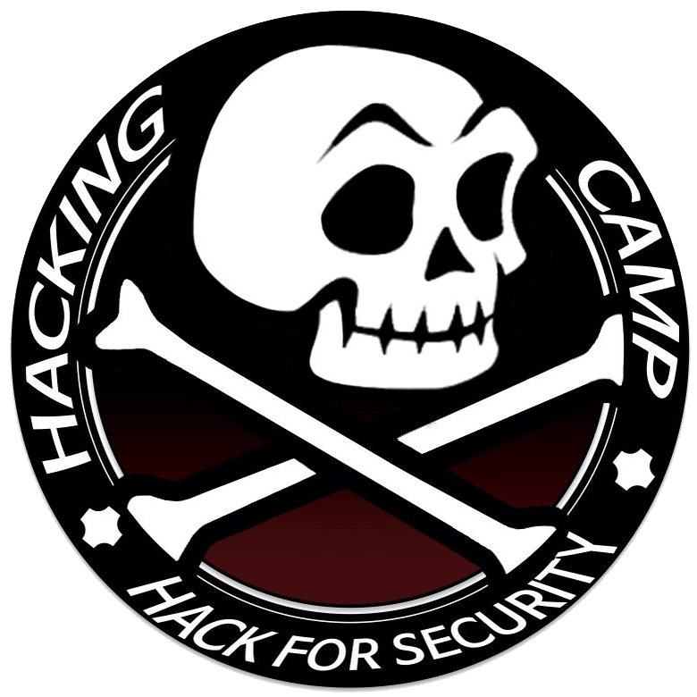

# 18th HACKING CAMP!
CTF Victory!! 1등
2018 9.1 ~ 9.2


## Key Note
> 발표자 : 정진욱(POC SECUIRTY)

```
시장 규모를 키우는 사람이 되자
 - 아직 한국은 하고 있지 않는 분야가 많음
 - 단순한 해외 솔루션 판매가 아닌 해외팀과의 연계
CTF로 돌아가보면
 - CTF 공부하면서 위협 모델을 생각하자
 - 알고 있는 것이 알고 있는 것이 아닌 경우가 많다
    -Writeup 제작,공유
 - 문제 풀이에 익숙해지면 문제 제작을 하자
 - 정보에 민감하게 반응하자(사람이 중요, 사람들을 많이 만나고 정보를 받아들이자)
```

## 나도 이제 악성코드를 분석해볼까?
> 발표자 : 차민석(안랩 시큐리티대응센터(ASEC)분석연구팀) 

> e-mail : minseok.cha@ahnlab.com / mstoned7@gmail.com

> https://www.facebook.com/xcoolcat7

> 보안에 미쳐라 책 출판

> 위험한 게임(war games)(1983) 영화 시청 추천

```
1. 악성코드 분석
  - 보안 사고의 시작과 끝인 경우가 많음
      뭘 알아야하지?
        - 리버싱 엔지니어링
        - platform
        - 악성코드 종류
        - 악성코드 기법 등
2. 분석 환경
  - 가상머신
  - 실제환경
    - 분석 도구
    - 이미지 복원 기능
    - 이미지 백업은 필수
3. 분석 도구
  - File info
    - file hash
    - file type
    - packer info
    - compiler info
  - Decoder/Unpacker
  - Decompiler
  - Unpacker
  - 난독화 해제
  - File Viewer
  - Hex Editor
  - die
4. 외형분석
  - Packing
  - Dropper
  - 의심스러운 문자열
    - 파일이름, 난독화문자열, API
  - 난독화
  - PDB
5. 분석과정
  - 정보 검색
  - 외형 분석
  - 행위 분석
  - 디스어셈블
  - 디버깅
  - 주석 달기
  - 분석 보고서
  - Threat Hunting

* 영어 공부를 많이 하자
* 악성코드는 많이 분석해봐야 된다. 경험을 많이 쌓자
```

## Deep dive analysis of hwp malware targeting cryptocurrency exchanges (Remaster Edition)
> 발표자 : 조효제(SECUI)

> 블로그 : sfkino.tistory.com

> SNS : facebook.com/hyoje.jo.3

```
- APT attacks
  - 암호화폐, hwp 공격 공부하셨음
- how to attack?
  - 악성 hwp가 포함된 스피어피싱 e-mail 전송으로 시작된다.
- Decoy Document
  - Decoy TYPE A. 이력서
  - Decoy TYPE B. 암호화폐 관련
  - Decoy TYPE C. 거래소 문의

- EPS Shellcode
  - Hwp Document
  - Post Script(ps,eps) - BodyText - DocOption - Scripts - HwpSummurInformation - DocInfo 등
```

## Digital Forensics a2A
> 발표자 : 김수영(선거관리위원회 디지털포렌식 담당자였었음)

```
- 디지털 포렌식의 기본 원칙
  - 정당성
  - 신속성
  - 재현
  - 연계보관성

- Live Forensics
  - 장점
    - 빠른 조사가 가능하다,
    - 증인에 대한 재 소환 조치등의 번거로운 절차가 간소화 될 수 있다.
    - 관련 서류가 많이 간소화 된다.
    - 관련 프로그램(Knox,KeySecure 등)이 손상되어 기기가 파손될 위험이 적다.
  - 단점
    - 모바일의 경우 Anti Forensics 적용이 쉽다.
    - 삭제된 데이터가 많을 경우 분석에 많은 시간이 소요될 뿐만 아니라, 정확한 분석확률도 많이 낮아지게 된다.

  - DF-IR
    - 디지털 포렌식 : 사후처리와 사법기관에서 인정받는게 목표, 증거물로서의 인정

https://www.facebook.com/Day0619Efact
```

## BROP (general ROP? nop, this is BROP!)
> 발표자 : 안건희(선린인터넷고)

```
- shellcode
  - 실행시키고자 하는 명령어를 실행시켜주는 코드
  - asm한 것을 opcode로 나타낸 것
- RTL
  - livc 메모리 영역 상에 mapping된 함수들을 사용하는 기법
- ROP
  - 바이너리 내부에 존재하는 기계어 조각들(가젯)을 가져와서 사용하는 기법
  - library
  - oriented programming
- Find for gadget tool
  - rp++ one_gadget, etc...
- BROP
  - 전체적으로 브로트포싱 + 기본적인 ROP합작
  - 한번 스크립트 돌릴 떄 30분 이상
```

## apt-get install heap
> 황호(bob5기, UST통합과정)

```
- dlmalloc
  - 리눅스에서 사용되는 힙 관리에 사용되는 memory allocator
  - dlmalloc이 사용되다가 쓰레드 기능이 추가된 ptmallocdmf 사용

char *p = malloc(size) //원하는 size만큼 malloc을 호출해 동적 메모리 할당
free(p) //사용한 메모리를 free를 통해 반환

- chunk
  - mem : malloc으로 할당 받은 부분
  - chunck : header와 mem을 포함하는 영역
  - size : 청크의 크기를 나타냄
  - prev_size : 인접한 안쪽 청크의 크기를 나타냄
- Chunk 종류
  - 할당된 청크
  - ptr = malloc()을 호출했을 때 생기는 heap영역
- Freed 청크
  - free(ptr)을 호출했을 때 실제로 반환되는 것이 아니라 힙 영역에 남아있으며 allocated 청크 구조에서 free chunk 구조로 변경됨
- Top 청크
  - 힙 영역의 가장 마지막에 위치하며 새롭게 할당(malloc)되면 ..
```

## Security option bypass 101
> 발표자 : 문시우(선린인터넷고)

> 블로그 : blog.withphp.com

```
- 웹 해킹 기법
  - XSS 
    - html,js를 사이트에 삽입해 클라이언트 정보를 빼오는 기법 (cookie,session)
    - stored xss , reflected xss 두개로 나뉨
  - SQL Injection 
    - 질의문(쿼리)을 조작해서 특정 로직을 우회하거나 데이터베이스에 있는 데이터를 빼오는 기법
  - LFI, RFI
    - 사용자가 입력한 키워드로
  - WebShell
    - 업로드 기능을 지원하는 사이트가 있다.   
- Security option이란?
  - 사용자와 서버의 안전을 위한 옵션
  - CSP
    - XSS를 막기위한 HTTP헤더
  - open_base dir
    - 함수를 사용하여 파일에 엑세스할 수 있는 위치 또는 경로를 정의
    - 사용자가 조작할 수 있는 파일을 디렉토리로 제한
    - 못 막는 함수
      - system, exec, shell_exec, passthru 등
  - disable_functions
    - 지정해놓은 함수는 호출이 불가능하게 만드는 옵션
```

## 버그헌팅 어렵지 않아 – 국내 미디어플레이어 취약점 제보기
> 발표자 : 최강준(세종대 정보보호학과)

> 블로그 : http://fandu.kr

> 발표 자료 : http://fandu.kr/bughunting/bughunting-tutorial/

```
- 소프트웨어 취약점 점검 방법
  - 화이트 박스 테스팅
    - 타겟 프로그램의 소스코드가 공개
    - AFL : http://lcamtuf.coredump.cx/afl/
    실행속도가 빠르며 symbolic execution 기능이 들어가 있어서 효율이 매우 좋음
  - 블랙 박스 테스팅 
    - 타겟 프로그램의 소스코드가 비공개
    - BFF
      - 사용법 검색하면 다 나옴
- 해야할 것
  - 콜 스택과 인자 확인
  - mutate된 바이트가 어떠한 역할을 하는 지 확인
  - ASLR을 우회하기 위한 Spray point 확인
  - 크래시 혹은 취약점이 발생한 모듈의 버전을 알알보고 최선 버전과 비교하여 어떠한 취약점이 있었는 지 확인
```

## 창과 방패: Cheat & Anti Cheat
> 발표자 : 김지오(중앙대학교 생명과학과, BOB7기 취약점분석 트랙)

```
- Cheat
  - 종류
    - 에임핵, esp, 무반동, 드랍핵, 월핵, 스피드핵, 매크로
  - 메모리 읽기
    - ReadProcessMemory function
  - 메모리를 읽고 쓰는 목적?
    - Function Hooking
      - Hooking
        함수호출, 메시지, 이벤트 등을 중간에서 바꾸거나 가로채는 것
  - inline patch
    - 어셈블리 직접 수정
    - code caving
  - dll injection
    - 함수
      - openProcess()
      - virtualAllocEx()
      - writeProcessMemory()
      - GetProcAddress()
    - 레지스트리 키
    - 윈도우 제공
    - API 설계 오류
- Anti-Cheat
```